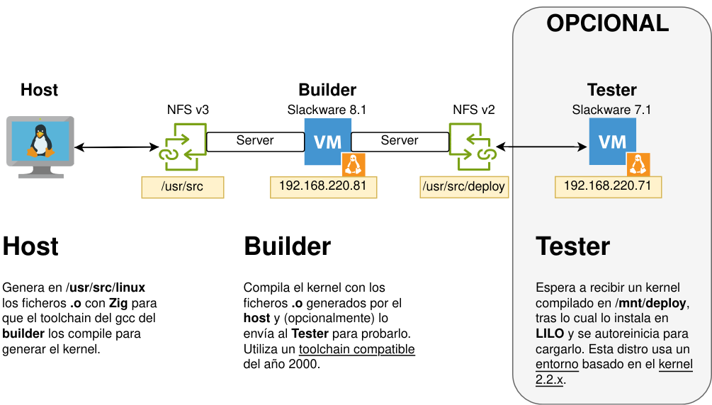

#  PROYECTO Kernel 2.2.5 en Zig

> Project225 is a personal learning experiment around Linux 2.2.5 and Zig.

> “This is not a Zig kernel. It’s an exploration. If you take one idea from here and build something better, that’s a win.”

<!-- no toc -->
- [¿Qué es este engendro?](#qué-es-este-engendro)
- [¿2.2.5? ¿porque es un cuadrado perfecto? 15x15](#225-porque-es-un-cuadrado-perfecto-15x15)
- [Instalación](#instalación)
- [Funcionamiento](#funcionamiento)
  - [Host](#host)
      - [Scripts utilizados por el host](#scripts-utilizados-por-el-host)
  - [VM builder](#vm-builder)
      - [Script utilizados por builder](#script-utilizados-por-builder)
  - [VM tester](#vm-tester)
      - [Script utilizados por tester](#script-utilizados-por-tester)
- [Prueba de concepto: Nuestro primer "Zinux" compilado](#prueba-de-concepto-nuestro-primer-zinux-compilado)
- [Borrador: Política de uso de Zig](#borrador-política-de-uso-de-zig)
- [Resolución de problemas](#resolución-de-problemas)
  - 

## ¿Qué es este engendro?

He montado un Setup usando bash, python y QEMU para **compilar un kernel sustituyendo los objetos `.o` C por objetos `.o` Zig** pudiendo probarlo en una VM conforme trabajamos con él.



Es un proyecto personal de aprendizaje en el cual he fusionado mi deseo de aprender más sobre el kernel de Linux y mi curiosidad sobre `Zig` ese (a día de hoy) nuevo emergente lenguaje de programación que pretende ser una mejora y alternativa a C.
| | |
|---|---|
|| El hecho de usar 2 VM es porque **compilar un kernel 2.2 con las herramientas actuales, sencillamente no funciona**. En más de 25 años las toolchains del kernel han cambiado muchísimo (para mejor afortunadamente). Ya no se usan muchos "hacks" y "triquiñuelas" que hoy son tan sólo errores de sintaxis. Los tags `asm` no compilan y un largo etc. Sobra decir que tampoco podrás ejecutarlo en un equipo actual.|

Las VM eligidas son las específicas para este propósito:

- tester: Slackware 7.1
  - Contemporánea al kernel 2.2.
  - El entorno "nativo" para ejecutar un kernel 2.2.
  - Incorpora cliente NFSv2 (para compartir ficheros con builder)

- builder: Slackware 8.1
  - Toochain incluido y 100% compatible para compilar kernel 2.2.
  - Incorpora servidor NFSv2 (para compartir ficheros con tester que no soporta v3)
  - Parcheando el kernel permite servidor NFSv3 (para compartir ficheros con host)

## ¿2.2.5? ¿porque es un cuadrado perfecto? 15x15

Tube la suerte de adquirir de segunda mano un excelente libro: _Linux Core Kernel Commentary_ de Scott Maxwell 1999.

En él se incluye impreso todo el código fuente del kernel 2.2.5. Sí, has leido bien **todo el código fuente** con explicaciones del autor sobre el mismo. Han pasado 25 años desde su publicación, muchas cosas se han quedado obsoletas, y la diferencia entre los kernels 6.x actuales es abismal, pero sigue siendo una obra de arte si te interesa "la esencia" de cómo funciona Linux por dentro.

Este proyecto ha sido la sinergia perfecta para aprender más sobre el funcionamiento interno del kernel de Linux y empezar con Zig. ¿Qué mejor que aprender ambos reescribiendo el kernel en Zig?.

Como opinión personal, un kernel 2.2 es el equilibro perfecto para empezar:
* suficientemente complejo para enseñar
* suficientemente pequeño para entender
* suficientemente antiguo para no importar

## Instalación

```bash
git clone https://github.com/josepuga/project225
cd project225
```

## Funcionamiento

Es importante entender que todo el workflow se genera con 3 actores, nuestro PC y 2 VM. Unos scripts automatizan la sinergia entre ellos.

### Host

Nuestra máquina Linux. Todo se maneja a través de scripts en Bash o Python en el directorio `bin/` del proyecto.

Usa tu editor favorito de Zig para ir convirtiendo el código C en Zig.

#### Scripts utilizados por el host

- `compile.sh`:
  - Genera un build.zig temporal (ephemeral build harness).
  - Gestiona módulos comunes.
  - Resuelve rutas.
  - Compila el módulo actual.
  - Genera un `override.mk` para incluir nuestro `.o` en el toolchain de `builder`.
- `mount-src-linux.sh`:
  - Monta la unidad NFSv3 `/usr/src/linux/` que comparte `builder` en `kernel-shared/`. Es decir **Los fuentes del kernel**
  - NOTA: Asegúrate de que tu sistema tiene activado `NFS Client v3`. Hoy en día la `v4` es la estándar.
- `run-vm.sh`:
  - Lanza una VM. `builder` o `tester`.
- `h2zig.py`:
  - Utilidad que convierte headers de C en ficheros Zig.
- `diff-kernels.py`:
  - Por si accidentalmente modificaste algún fichero fuente del kernel. Puedes comparar con otro directorio donde sepas que los fuentes están bien.

### VM builder

```
Distro: Slackware 8.1
Kernel: 2.4.18 y 2.4.20
    - Actualizado manualmente al 2.4.20 para activar NFSv3 por TCP
Hardware: 512M Ram, HD 2G, Net NIC2000, VGA Cirrus
    - Mac 00:00:02:02:05:81
Hostname: builder
IP: 192.168.122.81
Teclado: Español
    - loadkeys xx (temporal).
    - /etc/rc.d/rc.keymap (permanente)
Sólo user root (sin constraseña)
```

- Se encarga de compilar el kernel + juntos con los .o de Zig (El kernel 2.2.5 requiere un toolchain de C antiguo de ahí el uso de una VM)
- Monta `/usr/src/linux` con NFSv3 (para `host`).
- Monta `/usr/src/deploy` con NFSv2 (para `tester`).
- Opcionalmente puede enviar el kernel compilado + los módulos a `tester` para que arranque con dicho kernel.

#### Script utilizados por builder

- `make.sh`:
  - Realiza la compilación y linkado del kernel. Envía los logs del proceso a `/usr/src/linux/logs`
- `deploy.sh`:
  - Despliega el kernel y los módulos a `/usr/src/deploy`.
  - Si `tester` está ejecutando `watch-deploy.sh`, `tester` lo instalará y reiniciará para arrancar con él atomáticamente.
  - `reset-kernel-source.sh`: 
    - Borra todo el contenido de /usr/src/linux
    - Restaura de nuevo todo el código fuente
    - Restaura la configuracion de `.config`

### VM tester

```
Distro: Slackware 7.1
Kernel: 2.2.16 y 2.2.5
    - Por defecto arranca con 2.2.5
    - 2.2.16 está disponible siempre como alternativa por si hubiera algún error.
Hardware: 128M Ram, HD 1G, Net NIC2000, VGA Cirrus
    - Mac 00:00:02:02:05:71
Hostname: tester
IP: 192.168.122.71
Teclado: Español
    - loadkeys xx (temporal).
    - /etc/rc.d/rc.keymap (permanente)
Sólo user root (sin constraseña)
```

**_Esta VM es opcional, aunque recomendada. Permite validar el kernel_**.

Monitoriza que se haya compilado un kernel, en cuyo caso, lo instala como entrada en `LILO` y se reinicia con el nuevo kernel.

#### Script utilizados por tester

- `watcher-deploy.sh`:
  - Se queda esperando a que `builder` copie el kernel en `/mnt/deploy`
  - Lo instala en `/boot` y los módulos en `/lib/modules`
  - Ejecuta `lilo -v` para crear la entrada del arranque.
  - Reinicia la VM y arranca con el nuevo kernel.

Con la VM arrancada, puedes probar el nuevo kernel y volver a ejecutar `watcher-deploy.sh` para que espere a cargar otro (el nuevo machaca el anterior en la entrada de `LILO`).

**_NOTA:_** Siempre hay un kernel 2.2.16 de resguardo por si el sistema no arrancara. Teclea `linux` desde el prompt de `LILO`.

## Prueba de concepto: Nuestro primer "Zinux" compilado

El siguiente documento es un tutorial paso a pasa para compilar nuestro primer kernel sustituyendo el módulo `linux/init/version.c` por el equivalente en Zig.

[Leer más](doc/sample-version.c-es.md)

>NOTA: Muchos dispositivos, por ejemplo SCSI han sido desactivados en el `.config`. Con el toolchain de Slackware 8.1 dan errores debido a la implementación del código en ensamblador. Tenlo en cuenta a la hora de ejecutar un make menuconfig. No añadas módulos innecesarios, te ahorrarás dolores de cabeza.


## Borrador: Política de uso de Zig

Aquí intento explicar cómo se usa Zig en el Kernel, la forma de compilarse y sus limitaciones.

[Leer más](doc/zig-policy-es.md). Disponible sólo en español.

## Resolución de problemas

### Red no funciona en las VM
Hay que tener instalado ejecutándose `libvirtd` y tener la utilidad `virsh`. `systemctl status libvirtd` para comprobar que tenemos libvirtd activo.

Activamos `virsh`:
```bash
# De forma temporal
sudo virsh net-start default
# De forma persistente
sudo virsh net-autostart default
```
Libvirt nos permite usar un puente de red para comunicar por las VM con nuestro hosts. El nombre del puente podemos saberlo con:

```bash
ip link show type bridge
```
Debería aparecer `virbr0`.

El dispoistiv que nos aparezca, debemos ponernlo en `/etc/qemu/bridget.com`. 
```
allow virbr0
```
>Si te apareciera otro dispositivo distinto a `virbr0` Editar `bin/run-vm.sh` y modificar la variable virt_dev

#### Fedora
Tube que añadir al usuario a grupo libvirt. 

```bash
sudo usermod -aG libvirt <your user>
```

#### Debian
Sticky bit en qemu-bridge-helper. (?)

```bash
sudo chmod u+s /usr/lib/qemu/qemu-bridge-helper
```

### No puedo salir de la shell de la VM
Si mostrar la ventana de la VM está desactiado, es que pusiste en `run-vm.sh`
``bash
show_vm=0
```
Al apagar la VM, la shell del host sigue esperando la entrada por la salida serie de la VM.

Ejecuta el script `kill-vm.sh` para cerrarla completamente.

>TIP: Es buena idea teclear `reset` después de esto ya que algunas shells pueden quedarse corruptas y no mostrar el `echo` bien o motrar caracteres raros.

