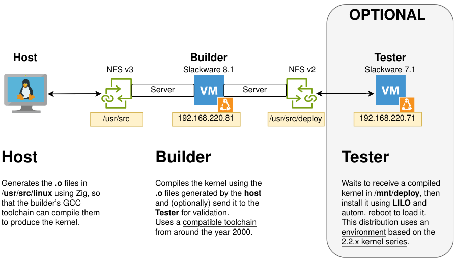

#  PROJECT Kernel 2.2.5 in Zig

> Project225 is a personal learning experiment around Linux 2.2.5 and Zig.

> “This is not a Zig kernel. It’s an exploration. If you take one idea from here and build something better, that’s a win.”

<!-- no toc -->
- [What is this monstrosity?](#what-is-this-monstrosity)
- [2.2.5? Why is it a perfect square? 15x15](#225-why-is-it-a-perfect-square-15x15)
- [Installation](#installation)
- [Operation](#operation)
  - [Host](#host)
      - [Scripts used by the host](#scripts-used-by-the-host)
  - [VM builder](#vm-builder)
      - [Script used by builder](#script-used-by-builder)
  - [VM tests](#vm-tester)
      - [Script used by tester](#script-used-by-tester)
- [Proof of concept: Our first "Zinux" build](#proof-of-concept-our-first-zinux-build)
- [Draft: Zig Usage Policy](#draft-zig-usage-policy)

## What is this monstrosity?

I made a Setup using bash, python and QEMU to **compile a kernel replacing the C objects `.o` by Zig objects `.o`** being able to test it in a VM as we work with it.



It is a personal learning project in which I have merged my desire to learn more about the Linux kernel and my curiosity about `Zig` that (today) is a new emerging programming language that aims to be an improvement and alternative to C.
| | |
|---|---|
|| The fact of using 2 VMs is because **compiling a 2.2 kernel with current tools simply does not work**. In more than 25 years, kernel toolchains have changed a lot (fortunately for the better). Many "hacks" and "tricks" are no longer used, which today are just syntax errors. The tags `asm` they do not compile and so on. Needless to say, you won't be able to run it on a current computer either.|

The VMs chosen are those specific for this purpose:

- tester: Slackware 7.1
  - Contemporary with kernel 2.2.
  - The "native" environment for running a 2.2 kernel.
  - Incorporates NFSv2 client (to share files with builder)

- builder: Slackware 8.1
  - Toochain included and 100% compatible for building kernel 2.2.
  - Incorporates NFSv2 server (to share files with tester that does not support v3)
  - Patching the kernel allows NFSv3 server (to share files with host)

## 2.2.5? Why is it a perfect square? 15x15

I was lucky enough to acquire an excellent second-hand book: _Linux Core Kernel Commentary_ by Scott Maxwell 1999.

It includes the entire 2.2.5 kernel source code printed. Yes, you have read **all the source code** correctly with the author's explanations about it. 25 years have passed since its publication, many things have become obsolete, and the difference between the current 6.x kernels is abysmal, but it is still a work of art if you are interested in "the essence" of how Linux works inside.

This project has been the perfect synergy to learn more about the inner workings of the Linux kernel and get started with Zig. What's better than learning both by rewriting the kernel in Zig?

As a personal opinion, a 2.2 kernel is the perfect balance to start with: complex enough to not bore you, but not so complex as to overwhelm you.

## Installation

You need `git lfs` installed for long file system support.

```bash
git clone https://github.com/josepuga/project225
cd project225
```

## Operation

It is important to understand that the entire workflow is generated with 3 actors, our PC and 2 VM. Some scripts automate the synergy between them.

### Host

Our Linux machine. Everything is handled through Bash or Python scripts in the directory `bin/` of the project.

Use your favorite Zig editor to convert C code into Zig.

#### Scripts used by the host

- `compile.sh`:
  - Generate a temporary build.zig (ephemeral build harness).
  - Manage common modules.
  - Resolve routes.
  - Compile the current module.
  - Generate a `override.mk` to include our `.o` in the toolchain `builder`.
- `mount-src-linux.sh`:
  - Mount the NFSv3 drive `/usr/src/linux/` that shares `builder` in `kernel-shared/`. That is **The kernel sources**
  - NOTE: Make sure your system has enabled `NFS Client v3`. Nowadays the `v4` it is the standard.
- `run-vm.sh`:
  - Launch a VM. `builder` o `tester`.
- `h2zig.py`:
  - Utility that converts C headers into Zig files.
- `diff-kernels.py`:
  - In case you accidentally modified any kernel source file. You can compare with another directory where you know the sources are good.

### VM builder

```
Distro: Slackware 8.1
Kernel: 2.4.18 y 2.4.20
    - Updated manually to 2.4.20 to activate NFSv3 TCP
Hardware: 512M Ram, HD 2G, Net NIC2000, VGA Cirrus
    - Mac 00:00:02:02:05:81
Hostname: builder
IP: 192.168.122.81
Keyboard Layout: Spanish
    - loadkeys xx (temporary).
    - /etc/rc.d/rc.keymap (permanent)
Only user root (no password)
```

- It is responsible for compiling the kernel + together with the Zig .o (The 2.2.5 kernel requires an old C toolchain hence the use of a VM)
- Mount `/usr/src/linux` with NFSv3 (for `host`).
- Mount `/usr/src/deploy` with NFSv2 (for `tester`).
- You can optionally send the compiled kernel + modules to `tester` so that it boots with said kernel.

#### Script used by builder

- `make.sh`:
  - Compile and link the kernel. Send the process logs to `/usr/src/linux/logs`
- `deploy.sh`:
  - Deploy the kernel and modules to `/usr/src/deploy`.
  - If `tester` is running `watch-deploy.sh`, `tester` will install it and reboot to boot with it automatically.
  - `reset-kernel-source.sh`: 
    - Delete all contents of /usr/src/linux
    - Restore all source code again
    - Restore the settings `.config`

### VM tests

```
Distro: Slackware 7.1
Kernel: 2.2.16 y 2.2.5
    - Por defecto arranca con 2.2.5
    - 2.2.16 está disponible siempre como alternativa por si hubiera algún error.
Hardware: 128M Ram, HD 1G, Net NIC2000, VGA Cirrus
    - Mac 00:00:02:02:05:71
Hostname: tester
IP: 192.168.122.71
Keyboard Layout: Spanish
    - loadkeys xx (temporary).
    - /etc/rc.d/rc.keymap (permanent)
Only user root (no password)
```

**_This VM is optional, although recommended. Allows you to validate the kernel_**.

Monitors that a kernel has been compiled, in which case, installs it as input into `LILO` and reboots with the new kernel.

#### Script used by tester

- `watcher-deploy.sh`:
  - It stays waiting for `builder` copy the kernel to `/mnt/deploy`
  - Install the kernel in `/boot` and the modules in `/lib/modules`
  - Run `lilo -v` to create the boot entry.
  - Reboot the VM and boot with the new kernel.

With the VM booted, you can try the new kernel and run again `watcher-deploy.sh` so that it waits to load another one (the new one overwrites the previous one at the entrance of `LILO`).

**_NOTE:_** There is always a backup kernel 2.2.16 in case the system does not boot. Type `linux` from the prompt `LILO`.

## Proof of concept: Our first "Zinux" build

The following document is a step by step tutorial to compile our first kernel by replacing the module `linux/init/version.c` for the equivalent in Zig.

[Read more](doc/sample-version.c-en.md)

>NOTE: Many devices, for example SCSI have been disabled in the `.config`. With the Slackware 8.1 toolchain they give errors due to the implementation of the code in assembly. Keep this in mind id you run a make menuconfig. Do not add unnecessary modules, you will save yourself headaches.


## Draft: Zig Usage Policy

Here I try to explain how Zig is used in the Kernel, how it is compiled and its limitations.

[Read more](doc/zig-policy-es.md). Available only in Spanish.
