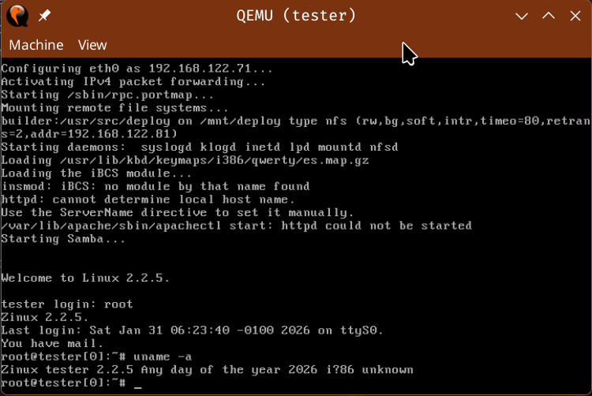
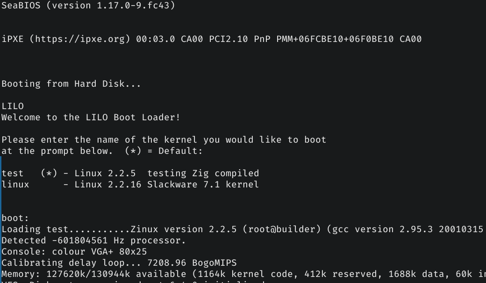

### PROOF OF CONCEPT: version.c

Here I am going to explain step by step how I generated the object of the zig version of the file `init/version.c` and compiling it along with the rest of the kernel. **It is convenient to do everything step by step as you read**.

> First I want to clarify that I am not an expert on Zig. As I already mentioned, this is a learning process. Surely there are more efficient ways to program in Zig, my intention is to serve as a guide for your future compilations.

>Kernel sources are treated as immutable artifacts.
All modifications are performed via object file injection.

### Prepare the Setup

I advise working on each VM (virtual machine) in a tab of your favorite console, it is more comfortable than typing in the QEMU window. I'm going to use 3 locations (or tabs) and refer to them from now on as:

- `host`: Your PC where you have Linux, your favorite editor and the development libraries to compile Zig.
- `builder`: The VM that will compile the kernel and submit it to `tester` to prove it.
- `tester`: The VM that will launch the new compiled kernel.

## We launch the VMs

In `builder`

```bash
/path/to/project255/bin/run-vm.sh builder
```

In `tester`

```bash
/path/to/project255/bin/run-vm.sh tester
```

In both VMs the user is root without password. 

Keyboard layout is in Spanish. Change to your layout:
```bash
loadkeys xx # Temporary
vim  /etc/rc.d/rc.keymap  # Permanent
```

> NOTE: if you want to work without tabs, directly from the VMs, edit the line of `bin/run-vm.sh` and put `host_shell=0`

## Preparing host

Kernel sources are at `builder` in `/usr/src/linux` and shares them using NFSv3. Make sure the VM is running before continuing.

```bash
cd /patch/to/project255
# Mount kernel sources from builder
# This command mount the sources in kernel-shared/.
bin/mount-linux-src.sh
ls kernel-shared  # To be sure
```

## Getting started

We already have the setup ready. Now we must use a directory inside `zig/`, by organization, it should match the name of the "module" you want to compile, in this case it is `version`. We assume you use VSCode.

>NOTE: The directory and all the tutorial files are already created, delete them to start from scratch.

```bash
cd zig/version && rm *
code .
```

From our editor:

- We create a `version.zig`
- We open `kernel-share/init/version.c`.

> TIP: If you want to quickly open a file pointed by version.c, for example, on the line

```c
#include <linux/version.h>
```

> CTRL-click on version.h and it will open directly in a new tab

### version.c

```c
#include <linux/uts.h>
#include <linux/utsname.h>
#include <linux/version.h>
#include <linux/compile.h>

#define version(a) Version_ ## a
#define version_string(a) version(a)

int version_string(LINUX_VERSION_CODE) = 0;

struct new_utsname system_utsname = {
	UTS_SYSNAME, UTS_NODENAME, UTS_RELEASE, UTS_VERSION,
	UTS_MACHINE, UTS_DOMAINNAME
};

const char *linux_banner =
	"Linux version " UTS_RELEASE " (" LINUX_COMPILE_BY "@"
	LINUX_COMPILE_HOST ") (" LINUX_COMPILER ") " UTS_VERSION "\n";
```

The code is simple at first glance. The first part

```c
#define version(a) Version_ ## a
#define version_string(a) version(a)

int version_string(LINUX_VERSION_CODE) = 0;
```

It is more complicated than it seems since this code is generated at compile time, which cannot be done with Zig.

The rest is a structure and a string that takes values ​​from the headers.

## Recreate headers in Zig

To make life easier, I have created a python script that converts the different C headers into Zig files.

- generates a `headername_h.zig` for each `headername.h`
- Respect the "one line comments".
- `#define` of chains turns them into `pub const "value"`.
- `#define` numeric converts them into `pub const value`.
- `#define` of macros are copied as comment in `headername_macros_h.zig`

It is not a perfect tool and has its limitations:

- Ignores any type of variable.
- Does not process multiline comments `/* */`, although the file is functional, you lose these comments.
- Does not expand macros.
- `#define NAME` worthless are not processed, only commented.
- Ignores `#ifdef /#ifndef`, it just comments them in their position so that you can do it manually.
- Does not process others `#include` although he comments on them. You must follow the recursion manually

> Despite its limitations, it saves a lot of time.

We are going to generate the different headers that it uses `version.c`

```bash
# let assume you are in zig/version and project225/bin is NOT in your PATH
../../bin/h2zig.py ../../kernel-shared/include/linux/version.h
../../bin/h2zig.py ../../kernel-shared/include/linux/uts.h
../../bin/h2zig.py ../../kernel-shared/include/linux/utsname.h
```

### The first obstacle

We have a problem with `compile.h`. This file is generated when compiling the kernel in `builder`, while Zig compiles it into `host`. This creates a circular dependency.

> These files in new kernels are located within `include/generated/`. Unfortunately with 2.2.x they are all generated in the same place.

The way to deal with it is to do it manually as shown below.

> TIP: The first time or if you have done a `make clean`, you will not have `compile.h`. From `builder`, to compile the kernel and generate it run: `make.sh`. Eliminate any `.o` what was in `kernel-shared/zig/` if you want to compile a "pure linux" kernel.

### "Polish the headers"

```bash
$ ls *_h.zig
uts_h.zig
utsname_h.zig
version_h.zig
version_macros_h.zig
```

It is important to note that **you do not have to process all the content of the headers**, just use what your `.c` in the code.

**Always compare the original C header with the generated Zig.**

#### compile_h.zig

```javascript
// From: include/linux/compile.h

// WARNING!. This values has been hardcode. Reason:
// compile.h is "generated" on the builder VM, while Zig is
// compiled on the host. This creates a circular dependency.

pub const UTS_VERSION = "Any day of the year 2026";
pub const LINUX_COMPILE_TIME = "00:00:00";
pub const LINUX_COMPILE_BY = "root";
pub const LINUX_COMPILE_HOST = "builder";
pub const LINUX_COMPILE_DOMAIN = "";
pub const LINUX_COMPILER = "gcc version 2.95.3 20010315 (release)";
```

**Must be created manually** As explained above, they are text strings that do not affect internal behavior. It is informative text such as when doing `uname -a`.

`version.c` use these values:

```c
// version.c
//(...)
struct new_utsname system_utsname = {
	UTS_SYSNAME, UTS_NODENAME, UTS_RELEASE, UTS_VERSION,
	UTS_MACHINE, UTS_DOMAINNAME
};

const char *linux_banner =
	"Linux version " UTS_RELEASE " (" LINUX_COMPILE_BY "@"
	LINUX_COMPILE_HOST ") (" LINUX_COMPILER ") " UTS_VERSION "\n";
//(...)
```

### uts_h.zig

```javascript
// AUTO-GENERATED from include/linux/uts.h
// DO NOT EDIT MANUALLY

// #ifndef _LINUX_UTS_H
// #ifndef UTS_SYSNAME
pub const UTS_SYSNAME = "Zinux";
// #endif
// #ifndef UTS_MACHINE
pub const UTS_MACHINE = "i386";
// #endif
// #ifndef UTS_NODENAME
pub const UTS_NODENAME = "(none)";
// #endif
// #ifndef UTS_DOMAINNAME
pub const UTS_DOMAINNAME = "(none)";
// #endif
// #endif
```

This is also very easy, in the same context, text strings that do not influence the code. I have changed `"Linux"` by `"Zinux"` to check that everything has worked by booting the new kernel and checking the version.

#### utsname_h.zig

```javascript
// AUTO-GENERATED from include/linux/utsname.h
// DO NOT EDIT MANUALLY

// #ifndef _LINUX_UTSNAME_H
pub const __OLD_UTS_LEN = 8;
pub const __NEW_UTS_LEN = 64;
// #endif
```

Here the Zig header is of no use to us, it can be deleted since the values `___*_UTS_LEN` are not used directly (actually `__NEW_UTS_LEN` It must be taken into account, but we will see it later). Nevertheless, `utsname.h` It does have code to convert.

`version.c` use the structure `new_utsname` which is found in `utsname.h` defined as:

```c
// utsname.h
//(...)
struct new_utsname {
	char sysname[65];
	char nodename[65];
	char release[65];
	char version[65];
	char machine[65];
	char domainname[65];
};
//(...)
```

Later we will define this Zig structure. This is the only important thing about `utsname.h`

#### version_h.zig

```javascript
// AUTO-GENERATED from include/linux/version.h
// DO NOT EDIT MANUALLY

pub const UTS_RELEASE = "2.2.5";
pub const LINUX_VERSION_CODE = 131589;
```

It seems simple, but here we have another of the "tricks" of the kernel 2.2 toolchain. That value of `LINUX_VERSION_CODE` will be used by the preprocessor to create a variable called `Version_131589`. You have to imitate this in Zig.

#### version_macros_h.zig

```javascript
// AUTO-GENERATED MACROS FROM version.h
// REVIEW AND PORT MANUALLY

// line 3: #define KERNEL_VERSION(a,b,c) (((a) << 16) + ((b) << 8) + (c))
```

This macro indicates how that value "131589" is generated. We are interested in the binary arithmetic it uses. We can eliminate `version_macros_h.zig`, we copy the macro line to our `version.zig` as a comment to take it into account.

## Now we generate code :)

### struct new_utsname

We already have a "global vision" of what it does and uses `version.c`. We include the headers

```javascript
const uts = @import("uts_h.zig");
const version = @import("version_h.zig");
const compile = @import("compile_h.zig");
```

We have to define the new_utsname structure which is in `utsname.h`

```c
// utsname.h
//(...)
struct new_utsname {
	char sysname[65];
	char nodename[65];
	char release[65];
	char version[65];
	char machine[65];
	char domainname[65];
};
//(...)
```

If you look at the value `65` is none other than `__NEW_UTS_LEN` (+1 for `\0`). Here they have "harcoded" it directly, that's why I said that it was not necessary to save the file `utsname_h.zig` just for a single variable. We can create a constant and put 65 directly to it for short.

```javascript
// version.zig
const UTS_LEN = 65;
pub const new_utsname = extern struct {
    sysname: [UTS_LEN]u8,
    nodename: [UTS_LEN]u8,
    release: [UTS_LEN]u8,
    version: [UTS_LEN]u8,
    machine: [UTS_LEN]u8,
    domainname: [UTS_LEN]u8,
};
```

This defines the structure the same as that of C.

### Strings C != Strings Zig

The variable system_utsname of type news_utsname is created and initialized.

```c
// version.c
struct new_utsname system_utsname = {
	UTS_SYSNAME, UTS_NODENAME, UTS_RELEASE, UTS_VERSION,
	UTS_MACHINE, UTS_DOMAINNAME
};
```

The conversion to Zig is direct because we already have the structure defined

```javascript
pub export var system_utsname: new_utsname = .{
    .sysname = uts.UTS_SYSNAME,
    .nodename = uts.UTS_NODENAME,
    .release = version.UTS_RELEASE,
    .version = compile.UTS_VERSION,
    .machine = uts.UTS_MACHINE,
    .domainname = uts.UTS_DOMAINNAME,
};
```

Easy, right? Not so fast. Here we come across a big difference between C and Zig. In C, the compiler pads these values ​​with \0 until the 65 bytes are filled. It does not save a pointer, length or metadata.

In our example `.machine = "i386"`. This C saves it as a `char[65]`:

```c
'i' '3' '8' '6' '\0' 0 0 0 0 0 ...
```

Until you reach 65.

But Zig treats it differently, .machine is saved as `*const [4:0]u8`:

```c
'i' '3' '8' '6' '\0'
```

Zig treats literals as null-terminated arrays, not as fixed buffers. That is, it does not fill with zeros. We have to create ABI compatibility. In this specific case, the program will surely work, but it is very risky, especially in the kernel, to leave a string with a shorter length: **Uninitialized memory read/undefined behavior**.

To fix this, I created a function in common.zig (within `zig/_common_modules`) which converts that string into a fixed array of length N. I have implemented 2 functions that do the same thing.

- common.fixedStringStd: Uses `std.mem.copy()`
- Common.FixedSringbare: Not uses `std`

> Why 2? I don't know if using std.mem.copy() can cause problems at any time. Just in case I have left a free std option.

With this modification, the code would look like this

```javascript
// version.zig
// (...)
const common = @import("common");
// (...)
const UTS_LEN = 65;
pub export var system_utsname: new_utsname = .{
    .sysname = common.fixedStringBare(UTS_LEN, uts.UTS_SYSNAME),
    .nodename = common.fixedStringBare(UTS_LEN, uts.UTS_NODENAME),
    .release = common.fixedStringBare(UTS_LEN, version.UTS_RELEASE),
    .version = common.fixedStringBare(UTS_LEN, compile.UTS_VERSION),
    .machine = common.fixedStringBare(UTS_LEN, uts.UTS_MACHINE),
    .domainname = common.fixedStringBare(UTS_LEN, uts.UTS_DOMAINNAME),
};
```

### linux_banner

This variable is used to display kernel information in `main.c` and `fs/proc/array.c`.

```c
// version.c
const char *linux_banner =
	"Linux version " UTS_RELEASE " (" LINUX_COMPILE_BY "@"
	LINUX_COMPILE_HOST ") (" LINUX_COMPILER ") " UTS_VERSION "\n";
```

Zig equivalent:

```javascript
// version.zig
// (...)
// '*' in [*:0] => C-style pointer. Instead of [:0]
pub export var linux_banner: [*:0]const u8 =
    "Zinux version " ++ version.UTS_RELEASE ++
    " (" ++ compile.LINUX_COMPILE_BY ++ "@" ++ compile.LINUX_COMPILE_HOST ++ ") (" ++
    compile.LINUX_COMPILER ++ ") " ++ compile.UTS_VERSION ++ "\n";
```

Well, it seems that we have everything finished, we have put `Zinux` and supposedly everything is already there. or not?

## First build

First of all, you have to add the following line (if it is not already there) to `zig/objects.txt`. 

>USE: `zig/` refers to the kernel path `/usr/src/linux/zig` not `zig/` of the host where we have our Zig sources.

```
init/version.o:zig/version.o
```

`compile.sh` reads that file and will generate the Makefile necessary for the `.o` of Zig have preference over those of C. This is automated, you just have to add the line of the C and Zig object file on which you work in `zig/objects.txt`.

Compiling Zig is not as easy as other languages ​​(At least for me with my current knowledge). I have created a bash script that automates the process:
- Generates a temporary `build.zig`.
- Compiles the source file.
- Copy the generated .o file to `kernel-shared/zig/`.
- Generates a Makefile that tells the C toolchain to include our `.o` instead of C one.
 
```bash
../../bin/compile.sh version.zig
```

Output:

```
Generating build.zig...
Compiling version.o...
Cleaning...

/path/to/kernel-shared/zig/version.o created!
00000000 r __anon_517
00000188 D linux_banner
00000000 D system_utsname
```

### Check both ABIs

It seems that it compiled without problems and we can now generate our first Zinux kernel! Not so fast. The last lines of the output are from the command `nm` of the shell to see the symbol table of the object file.

To ensure binary compatibility, you must check it with the table that shows `init/version.o` of the kernel.

> TIP: If you don't already have `init/version.o`, do a kernel build on `build` con `make.sh`. Delete before `kernel-shared/zig/version.o` if it were.

```bash
nm /path/to/kernel-shared/init/version.o
```

```
00000000 D Version_131589
00000000 t gcc2_compiled.
000001a8 D linux_banner
00000020 D system_utsname
```

What a disappointment! Calm down. Let's think about the positive,`linux_banner` y `system_utsname` match in name and section `.data` (the D). It doesn't matter that the offset doesn't match, the kernel doesn't look at offsets, but rather symbols.

Let's examine the other 2 lines step by step.

#### 00000000 t gcc2_compiled.

This is a symbol generated from gcc 2.x. the `t` lowercase indicates that it is local and static in the section `.text`

It doesn't affect anything. The Zig compiler generates that local "garbage" value, although in the read only sections like `.rodata` (in this case). ignore.

#### 00000000 D Version_131589

Here we are already getting into the tricks and subterfuges of the kernel preprocessor. It is important to understand that this variable **_is generated by the C_ preprocessor**. It's not that it has any value, but the actual value is irrelevant, the name matters: `Version_131589`. It's a bizarre way of saying `Version = 131589` welcome to the world of kernel 2.2.

But where does that number come from? We return to the C source code that gives us the clue:

```c
// version.c
// (...)
#define version(a) Version_ ## a
#define version_string(a) version(a)

int version_string(LINUX_VERSION_CODE) = 0;
// (...)


// version.h
#define UTS_RELEASE "2.2.5"
#define LINUX_VERSION_CODE 131589
#define KERNEL_VERSION(a,b,c) (((a) << 16) + ((b) << 8) + (c))
```

131589 comes from doing the following binary arithmetic operation with the kernel version `2.2.5` as shown in the macro `KERNEL_VERSION(a,b,c)`

```c
a = 2, b = 2, c = 5
Number = ((a) << 16) + ((b) << 8) + (c))
```

There are 2 ways to fix this.

##### The easy way, blue pill

Create a variable with that name:

```javascript
pub export var Version_131589: i32 = 1;
```

There is an important detail, if it has a value of 0, the compiler will save it in the Block Started by Symbol section `.bss (B)` rather `.data (D)`. `.bss` works exactly the same as `.data` but for uninitialized variables. **This does not affect the kernel**, but I prefer to have it in `.data`.

The problem with this "hardcoded" variable approach is that if you changed kernel version, you would have to remember and manually change the value by recalculating `KERNEL_VERSION()`.

> If you settle for this, nothing happens, you write that line, you will wake up tomorrow in your bed and believe what you want to believe.

#### The difficult way, red pill

This is the difficult way, the one that if you are reading this you will surely choose, because you want **_to learn to do things correctly_**.

First we must make a versatile code that works for any version of the kernel and calculates the number for us. This variable "v" could be generated in a script, or an external process depending on the kernel version. For this example we place it directly in the code.

```javascript
// This v variable should be created in an external file
const v: [3]u32 = .{2,2,5};
// The const's name here doesn't matter.
pub const LINUX_VERSION_CODE: u32 = (v[0] << 16) + (v[1] << 8) + v[2];

```

The **name of the variable is not important**, I have chosen `LINUX_VERSION_CODE` for affinity with the C code, but you can call it `foo` if you like.

Now you have to create a variable called "Version_" + LINUX_VERSION_CODE, that is `Version_131589`.

```javascript
// var! not const
var version_storage: i32
    linksection(".data") = 0;
```

Required variable (see below), and another way to force the data section to be assigned a value of 0, is to use `linksection()`. The value of version_storage does not matter here either, use the method you prefer if you want to put it in `.data`:

- Value 0 using linksection(".data")
- Value != 0

Now we have to tell the Zig compiler: _"This block of memory ``version_storage`, will be called `Version_131589` in the linker"_.

```javascript
comptime {
    const version_name =
        "Version_" ++ std.fmt.comptimePrint("{}", .{LINUX_VERSION_CODE});
    @export(&version_storage, .{
        .name = version_name,
        .linkage = .strong});
}
```

- We create a constant version_name = "Version_131589"
- We export version_storage to the linked one and give it the famous name `Version_131589`.

### Code and final build

The code of `version.zig` should be this.

```javascript
const std = @import("std");
const common = @import("common");

const uts = @import("uts_h.zig");
const version = @import("version_h.zig");
const compile = @import("compile_h.zig");

const v: [3]u32 = .{2,2,5};
pub const LINUX_VERSION_CODE: u32 = (v[0] << 16) + (v[1] << 8) + v[2];


var version_storage: i32
    linksection(".data") = 0;
comptime {
    const version_name =
        "Version_" ++ std.fmt.comptimePrint("{}", .{LINUX_VERSION_CODE});
    @export(&version_storage, {
        .name = version_name,
        .linkage = .strong
    });
}

const UTS_LEN = 65;
pub const new_utsname = extern struct {
    sysname: [UTS_LEN]u8,
    nodename: [UTS_LEN]u8,
    release: [UTS_LEN]u8,
    version: [UTS_LEN]u8,
    machine: [UTS_LEN]u8,
    domainname: [UTS_LEN]u8,
};

pub export var system_utsname: new_utsname = .{
    .sysname = common.fixedStringBare(UTS_LEN, uts.UTS_SYSNAME),
    .nodename = common.fixedStringBare(UTS_LEN, uts.UTS_NODENAME),
    .release = common.fixedStringBare(UTS_LEN, version.UTS_RELEASE),
    .version = common.fixedStringBare(UTS_LEN, compile.UTS_VERSION),
    .machine = common.fixedStringBare(UTS_LEN, uts.UTS_MACHINE),
    .domainname = common.fixedStringBare(UTS_LEN, uts.UTS_DOMAINNAME),
};

pub export var linux_banner: [*:0]const u8 =
    "Zinux version " ++ version.UTS_RELEASE ++
    " (" ++ compile.LINUX_COMPILE_BY ++ "@" ++ compile.LINUX_COMPILE_HOST ++ ") (" ++
    compile.LINUX_COMPILER ++ ") " ++ compile.UTS_VERSION ++ "\n";

```

If we compile again, now the ABI of both objects matches.

```
00000000 r __anon_517
00000188 D linux_banner
00000000 D system_utsname
00000000 D Version_131589
```

## Check if it works

### Compile the kernel

In builder we execute `make.sh` to compile the kernel. If everything has gone well, we will see the final OK

```
Running: make bzImage to log/make-bzImage.log
Done: make bzImage

Running: make modules to log/make-modules.log
Done: make modules

Running: make modules_install to log/make-modules_install.log
Done: make modules_install

  ZIG:   init/version.o -> init/version.c

OK
```

### Test the kernel in tester

`tester` Is Slackware 7.1. Distro contemporary with kernel 2.2. There will be no compatibility problems, that's why I chose it.

In `tester` I have a script that is waiting for  `builder` send the kernel. Install it and reboot by booting with it.

Type:

```bash
watch-deploy.sh
```

The program waits to receive the kernel.

Now from `builder`:

```bash
deploy.sh
```

In a few seconds `tester` will show message:

```
DEPLOY trigger detected!
Calling install-kernel.sh
Copying vmlinuz-test to /boot...
Installing kernel modules...
Configuring LILO and Rebooting...
```

The VM will be restarted. now from the shell, you can check that we are with our "Zinux" :)

>Choose `version.c` as an initial conversion it allows us to quickly check if our kernel works before starting with more complicated things.

There are several ways to display the variable `linux_banner` what we define:

```bash
root@tester[127]:~# uname -a
Zinux tester 2.2.5 Any day of the year 2026 i?86 unknown
root@tester[0]:~# dmesg | head -n 1
Zinux version 2.2.5 (root@builder) (gcc version 2.95.3 20010315 (release)) Any day ...
root@tester[0]:~# cat /proc/version
Zinux version 2.2.5 (root@builder) (gcc version 2.95.3 20010315 (release)) Any day ...
```

 

